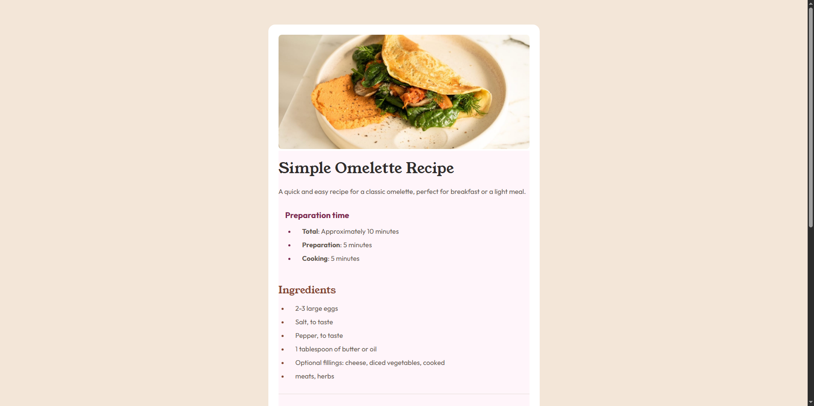

# Frontend Mentor - Recipe page solution

This is a solution to the [Recipe page challenge on Frontend Mentor](https://www.frontendmentor.io/challenges/recipe-page-KiTsR8QQKm). Frontend Mentor challenges help you improve your coding skills by building realistic projects. 

## Table of contents

- [Overview](#overview)
  - [Screenshot](#screenshot)
  - [Links](#links)
- [My process](#my-process)
  - [Built with](#built-with)
  - [What I learned](#what-i-learned)
  - [Useful resources](#useful-resources)
- [Author](#author)

## Overview

### Screenshot

Screenshot was made by [Screenshot Capture](https://chromewebstore.google.com/detail/screenshot-capture/giabbpobpebjfegnpcclkocepcgockkc)

### Links

- Solution URL: [GitHub project page](https://github.com/ostrozhanskyi/recipe-page)
- Live Site URL: [GitHub Pages Link](https://ostrozhanskyi.github.io/recipe-page/)

## My process

### Built with

- HTML5
- CSS

### What I learned

Didn't figure out how to make the last table in more efficient way;
Couldn't find a way to make top margin to gradually change from 0 so took a ChatGPT approach with clamp();

### Useful resources

- [W3Schools](https://www.w3schools.com/) - Great resource for HTML and CSS references
- [ChatGPT](https://chatgpt.com/) - Great thing to ask questions about some tricky situations but you shouldn't rely on it too much for learning purposes

## Author

- Website - [GitHub](https://github.com/ostrozhanskyi)
- Frontend Mentor - [@ostrozhanskyi](https://www.frontendmentor.io/profile/ostrozhanskyi)